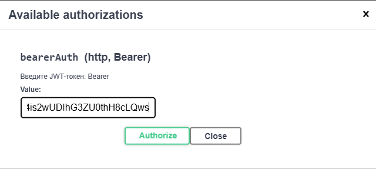

# Book Chat AST
Приложение для ведения чата с персонажами книги

## Требования

- **Docker** и **Docker Compose** (для запуска в контейнерах)
- **Git** (для клонирования репозитория)

---

### Склонировать проект: https://github.com/a-skrip/book-chat-ast.git

---
1. Перейти в корень проекта
2. Создать файл .env
```
DB_USERNAME=postgres
DB_PASSWORD=postgres
MISTRAL_API_KEY={ключ для MISTRAL}
```


3. Собрать и запустить приложение с базой данных

```bash
docker-compose up -d --build
```
---
swagger: http://localhost:8080/swagger-ui/index.html#

При первом запуске уже будет администратор и загружена книга, но не разбита на чанки

для обработки книги войти в систему:
```
POST http://localhost:8080/api/auth/login
{
  "username": "test@test.com",
  "password": "123456"
}
```
запрос вернет JWT token его вставить в swagger ->>>  


после этого все закрытые ендпоинты станут доступны

далее для обработки книги и выделения персонажей:
```
POST http://localhost:8080/api/books/{bookId}/chunks
```

### ПРОЦЕСС на 20-30 минут, после этого можно вести чат 

####################################################

Поднятие фронта локально:
 перейти в папке проекта в /front
```bash
pnpm dev
```
приложение для чата: http://localhost:5173/

админка по: http://localhost:5174/


####################################################

### создание и запуск БД в Docker 
- скопировать образ БД Postgres c расширением PGVector
```bash
docker pull pgvector/pgvector:pg17
```
- запуск контейнера
```bash
- docker run -d --name postgres_db_vector `
-p 5433:5432 `
-e POSTGRES_USER=postgres ` 
-e POSTGRES_PASSWORD=postgres ` 
-v postgres_data:/var/lib/postgresql/data ` 
-e POSTGRES_DB=books_db pgvector/pgvector:pg17
```
#

